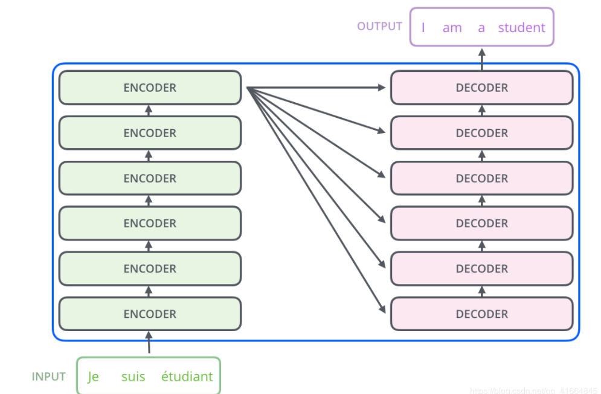
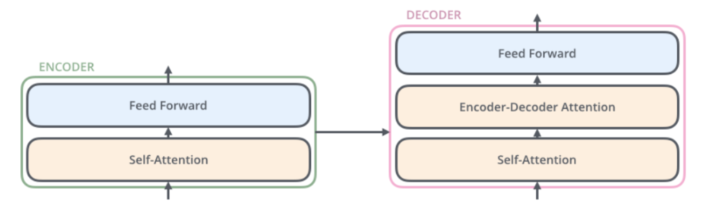
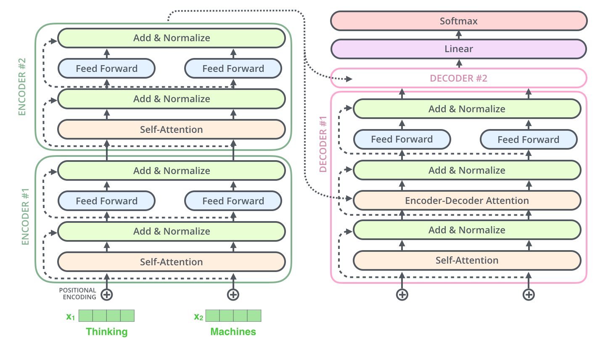
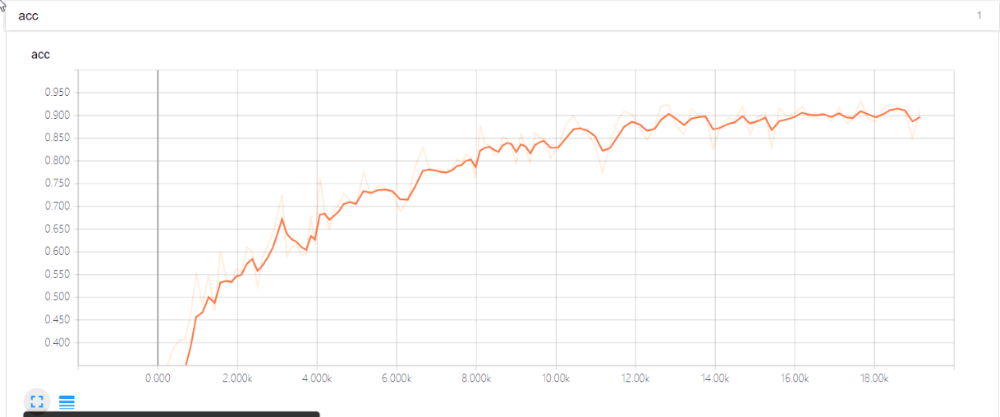
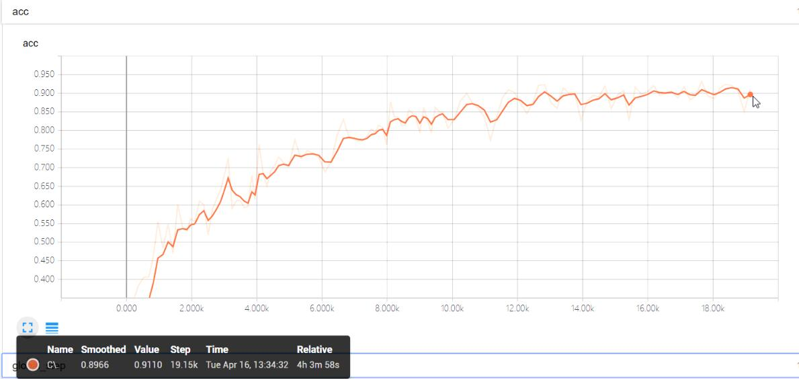
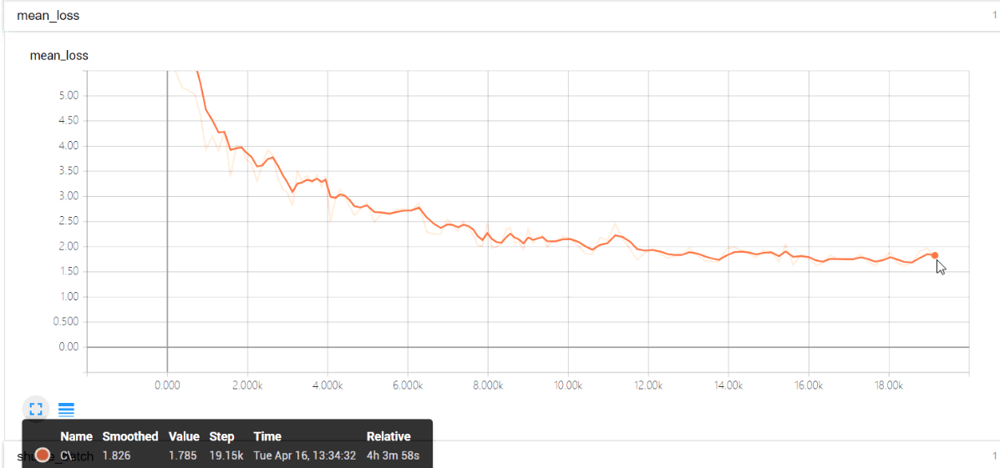
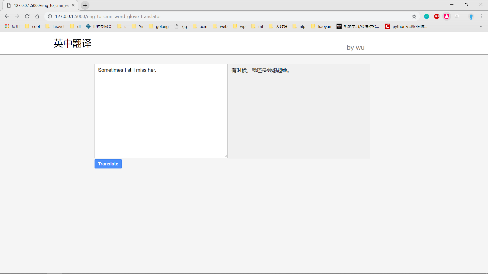
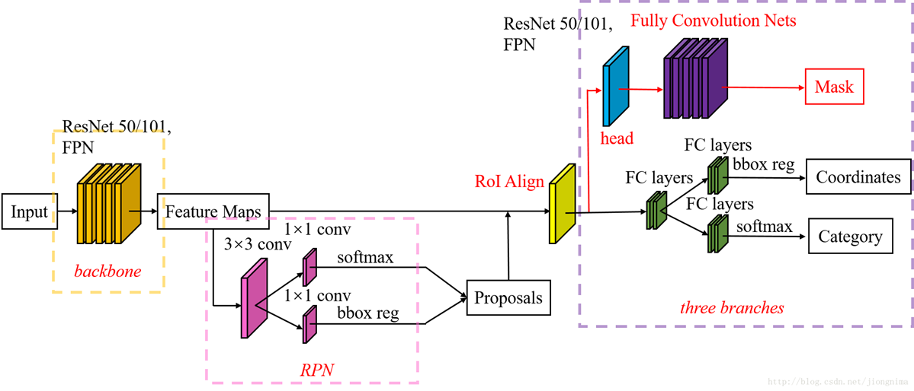
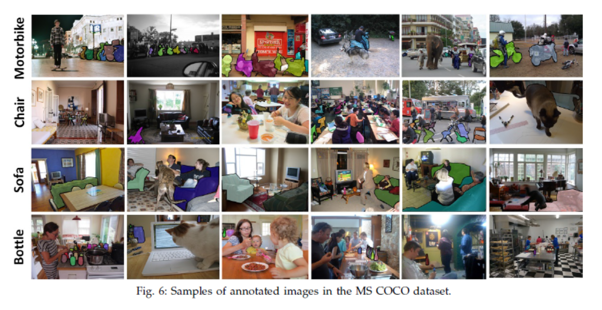
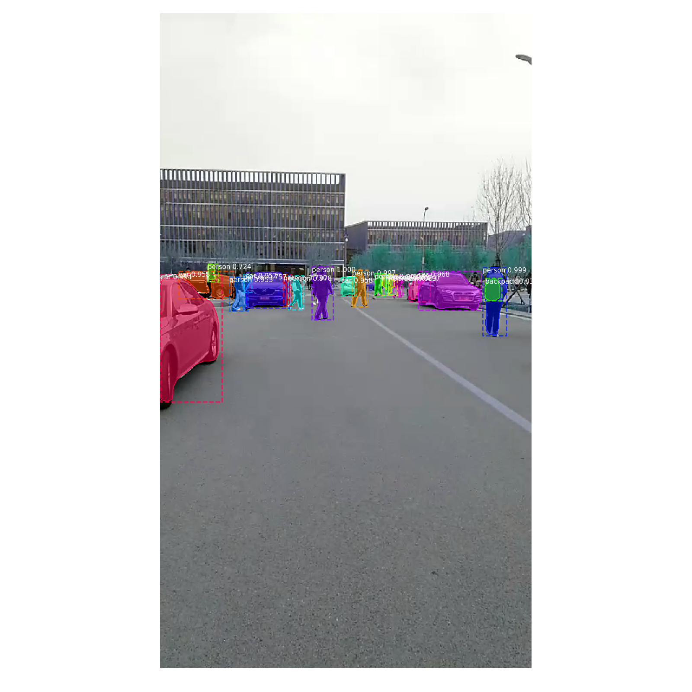

<!-- TOC -->

- [github：https://github.com/wuhao050698/deep-learning-homework](#githubhttpsgithubcomwuhao050698deep-learning-homework)
- [深度学习作业文档](#%E6%B7%B1%E5%BA%A6%E5%AD%A6%E4%B9%A0%E4%BD%9C%E4%B8%9A%E6%96%87%E6%A1%A3)
  - [机器翻译](#%E6%9C%BA%E5%99%A8%E7%BF%BB%E8%AF%91)
    - [1.transformer](#1transformer)
      - [模型介绍](#%E6%A8%A1%E5%9E%8B%E4%BB%8B%E7%BB%8D)
      - [运行环境](#%E8%BF%90%E8%A1%8C%E7%8E%AF%E5%A2%83)
    - [2.seq2seq (Glove)](#2seq2seq-glove)
      - [演示视频](#%E6%BC%94%E7%A4%BA%E8%A7%86%E9%A2%91)
      - [依赖环境](#%E4%BE%9D%E8%B5%96%E7%8E%AF%E5%A2%83)
      - [模型介绍](#%E6%A8%A1%E5%9E%8B%E4%BB%8B%E7%BB%8D-1)
    - [3.Mask-Rcnn](#3mask-rcnn)
      - [依赖环境](#%E4%BE%9D%E8%B5%96%E7%8E%AF%E5%A2%83-1)
      - [项目结构](#%E9%A1%B9%E7%9B%AE%E7%BB%93%E6%9E%84)
      - [模型介绍](#%E6%A8%A1%E5%9E%8B%E4%BB%8B%E7%BB%8D-2)

<!-- /TOC -->
# github：https://github.com/wuhao050698/deep-learning-homework
# 深度学习作业文档
## 机器翻译
word2vec简单笔记(https://github.com/wuhao050698/ml-note/blob/master/word2vec.md)
### 1.transformer
#### 模型介绍
模型的介绍不是作业的重点，所以简单介绍一下。

transformer不同于机器翻译常用的Seq2seq+attention模型，它是一种**完全基于Attention**的模型，跟Seq2seq模型类似，但有所不同，seq2seq只有一个编码器和一个解码器，而它由6个Encoder和6个Decoder组成。

1. 编码器(Encoder)：它们都结构都是相同的，但是它们之间并不会共享权重，每个Encoder由两个部分组成，分别是一个self-attention层和全连接的前馈神经网络。
   1. self-attention：也就是自注意力机制，普通的attention机制是当前的输出对每个输入都计算一个注意力权重，来让输出的信息更关注它需要关注的原句信息。而self-attention顾名思义，它的作用是让输入序列中的当前单词对输入序列中的其他单词计算一个注意力权重，也就是说self-attention是计算这个句子内部的单词之间的相互关系，它的作用就是识别**句子中单词之间的逻辑关系，同时也能学习到句子中的语义信息。**
      -  multi-headed attention——transform还使用了多头注意力机制来完善了self-attention
   2. 全连接的前馈神经网络，将输入信息进行学习。
2. 解码器(Decoder):解码器比编码器多了一个attention层，也就是seq2seq模型中常用的attention机制，它能提高解码器在输出过程中输出的序列信息的质量。

---
#### 运行环境
- tensorflow-gpu
- GPU: GTX940MX
- 内存: 12g

由于显卡并不能满足模型的运行要求，导致在训练该模型时训练速度很慢，在训练句子长度为25个词，中英平行语料为20w的情况下，模型的训练速度大概为一个epoch 3个小时，而准确率要达到90%+预计需要30个epoch左右，硬件资源不太能满足训练条件。

后来又选择了20w条语料，将句子长度限制在10个词，在这个条件下，训练速度就比较快，大概10分钟就能跑一个epoch，tensorboard可视化的训练过程如下：

最后的训练的准确率达到了90%+，loss也基本上收敛了，效果很好，但是由于限制了10个词的长度，演示效果很差，所以后来又训练了一个简单的seq2seq模型用于界面展示。
### 2.seq2seq (Glove)
#### 演示视频
https://www.bilibili.com/video/av50130062/
#### 依赖环境
package|version
-|-
pyhton| 3.5.6
keras| 2.2.2
tensorflow| 1.10.0
Flask|0.12.2

#### 模型介绍
Seq2seq+Glove
词向量：这个模型没有使用常用的word2vec，为了训练的快速和简单，选择了Glove作为模型的词向量的训练方法。

Seq2seq 使用了Bi-LSTM作为编码器，LSTM作为解码器。
同样也是为了训练速度比较快，所以数据集只使用了2W条，也就是2W条英中平行语料。

最后使用Flask和html实现web界面后如下：

### 3.Mask-Rcnn
#### 依赖环境
package|version
-|-
pyhton| 3.6.8
keras| 2.0.8
tensorflow| 1.10.0
CV2|-
输入:视频
#### 项目结构
- main.py
  - 对输入的视频逐帧进行语义分割
- mainLive.py
  - 连接网络摄像头进行实时的语义分割
- coco.py
  - 训练coco数据集
#### 模型介绍
模型介绍:https://blog.csdn.net/jiongnima/article/details/79094159

数据集格式:

结果样例（学校食堂门口）

